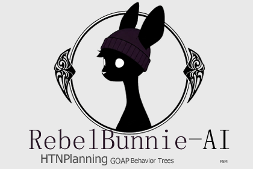

# RebelRabbit-AI
**AI Development Roadmap**

  

# Phase One: Basic Navigation

**Objective**: Implement basic navigation for AI agents.

1. Create a simple AI using Unity's navigation system.
2. Move the agent to a specified goal point.
3. Navigate around obstacles.

**Success Criteria**: The agent can reach the goal point while avoiding obstacles.

# Phase Two: Finite State Machine (FSM)

**Objective**: Implement a Finite State Machine for AI behavior.

1. Create the basic structure of an FSM.
2. Define states:
   - Idle: The agent starts in an idle state.
   - Scan: The agent scans and detects the goal.
   - Move: The agent moves towards the goal.
   - Exit: The agent returns and exits.

**Success Criteria**: The agent transitions correctly between states based on conditions.

# Phase Three: Goal-Oriented Action Planning (GOAP)

**Objective**: Implement GOAP for dynamic AI behavior planning.

1. Create the basic structure of GOAP.
2. Develop an action plan.
3. Define states:
   - Idle: The agent starts in an idle state.
   - Scan: The agent scans and detects the goal.
   - Move: The agent moves towards the goal.
   - Exit: The agent returns and exits.
4. Extra: Handle complex scenarios with double obstacles and enemies.

# Phase Four: Hierarchical Task Network (HTN) Planning

**Objective**: Implement HTN for hierarchical task planning.

1. Create the basic structure of HTN.
2. Develop a task plan.
3. Define states:
   - Idle: The agent starts in an idle state.
   - Scan: The agent scans and detects the goal.
   - Move: The agent moves towards the goal.
   - Exit: The agent returns and exits.
4. Extra: Implement object pickup and following behaviors.

# Phase Five: Behavior Tree

**Objective**: Implement a Behavior Tree for complex AI behavior.

1. Create the basic structure of a behavior tree.
2. Develop a behavior plan.
3. Define states:
   - Idle: The agent starts in an idle state.
   - Scan: The agent scans and detects the goal.
   - Move: The agent moves towards the goal.
   - Exit: The agent returns and exits.
4. Extra: Update objectives based on events and search for enemies to eliminate.

# Link Asset Store Unity
**Coming Soon**

# KeyWords
such as:

#Unity
#AI
#Artificial Intelligence"
#Navigation
#FSM 
#Finite State Machine
#GOAP
#Goal-Oriented Action Planning
#HTN
#Hierarchical Task Network
#Behavior Tree
#Game AI

